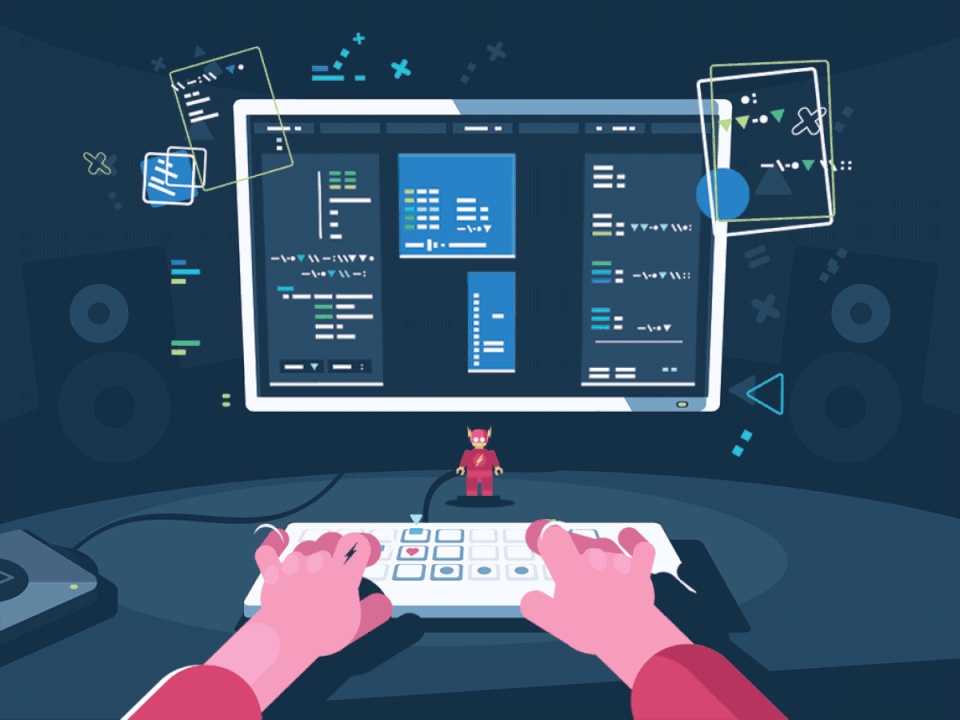

    

𝙸'𝚖 𝚊 𝚙𝚊𝚜𝚜𝚒𝚘𝚗𝚊𝚝𝚎 𝚍𝚎𝚟𝚎𝚕𝚘𝚙𝚎𝚛 𝚠𝚑𝚘 𝚝𝚑𝚛𝚒𝚟𝚎𝚜 𝚘𝚗 𝚋𝚞𝚒𝚕𝚍𝚒𝚗𝚐  🛠️, b𝚛𝚎𝚊𝚔𝚒𝚗𝚐  🧨, 𝚊𝚗𝚍 𝚕𝚎𝚊𝚛𝚗𝚒𝚗𝚐 📚 𝚝𝚑𝚛𝚘𝚞𝚐𝚑 𝚌𝚘𝚍𝚎. 
  
𝙼𝚢 𝙶𝚒𝚝𝙷𝚞𝚋 𝚒𝚜 𝚊 𝚍𝚒𝚐𝚒𝚝𝚊𝚕 𝚕𝚊𝚋 🧪 𝚠𝚑𝚎𝚛𝚎 𝙸 𝚎𝚡𝚙𝚎𝚛𝚒𝚖𝚎𝚗𝚝 𝚠𝚒𝚝𝚑 𝚝𝚎𝚌𝚑𝚗𝚘𝚕𝚘𝚐𝚒𝚎𝚜 𝚊𝚌𝚛𝚘𝚜𝚜 𝚝𝚑𝚎 𝚜𝚝𝚊𝚌𝚔.

𝙲𝚞𝚛𝚛𝚎𝚗𝚝𝚕𝚢, 𝙸'𝚖 𝚒n 𝚋𝚞𝚒𝚕𝚍-𝚕𝚎𝚊𝚛𝚗-𝚛𝚎𝚙𝚎𝚊𝚝 𝚖𝚘𝚍𝚎 🚧.

  <!-- Row of stats -->
  

    
    
  

  <!-- Contribution graph -->
  

